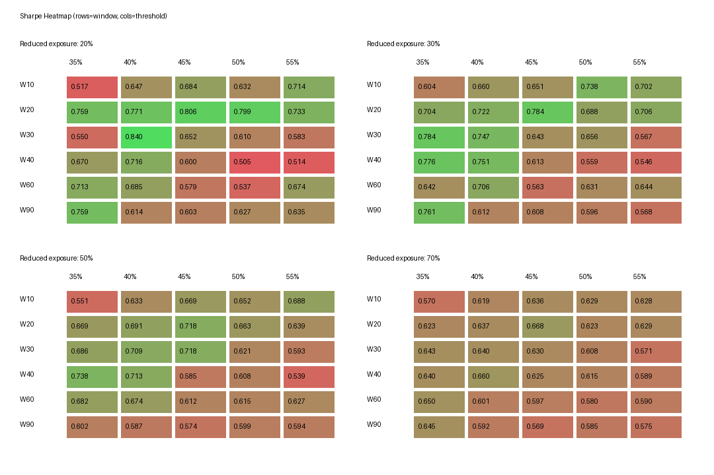
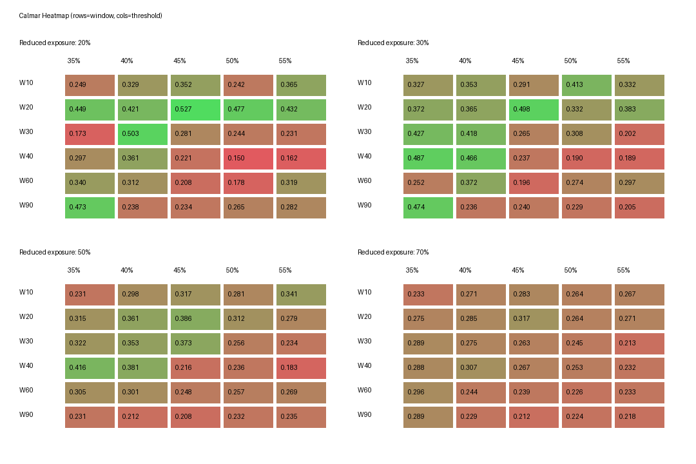

# Quality Cleanup + Volatility Overlay 鲁棒性研究

## 参数稳定性

- 完整搜索：120组，窗口6档、阈值5档、降仓比例4档。
- 固定排序：Sharpe降序 → Calmar降序 → 最大回撤绝对值升序 → 平均仓位降序。
- 全样本最优：`W30_T40_E20`。
- 最优点邻域：4/18组同时达到最优Sharpe和Calmar的90%，平台判定：否。

### 当前主参数

| 策略 | 窗口 | 阈值 | 低波动仓位 | 年化收益 | 最大回撤 | 夏普比率 | Calmar | 超额收益 | 平均仓位 |
| --- | --- | --- | --- | --- | --- | --- | --- | --- | --- |
| W20_T45_E30 | 20 | 45.00% | 30.00% | 16.28% | -32.71% | 0.784 | 0.498 | 364.68% | 97.46% |

### 固定规则 Top10

| 策略 | 窗口 | 阈值 | 低波动仓位 | 年化收益 | 最大回撤 | 夏普比率 | Calmar | 超额收益 | 平均仓位 |
| --- | --- | --- | --- | --- | --- | --- | --- | --- | --- |
| W30_T40_E20 | 30 | 40.00% | 20.00% | 17.38% | -34.56% | 0.840 | 0.503 | 422.58% | 96.44% |
| W20_T45_E20 | 20 | 45.00% | 20.00% | 16.84% | -31.96% | 0.806 | 0.527 | 393.46% | 97.25% |
| W20_T50_E20 | 20 | 50.00% | 20.00% | 16.95% | -35.52% | 0.799 | 0.477 | 399.35% | 97.48% |
| W30_T35_E30 | 30 | 35.00% | 30.00% | 15.61% | -36.58% | 0.784 | 0.427 | 332.32% | 95.84% |
| W20_T45_E30 | 20 | 45.00% | 30.00% | 16.28% | -32.71% | 0.784 | 0.498 | 364.68% | 97.46% |
| W40_T35_E30 | 40 | 35.00% | 30.00% | 15.59% | -31.99% | 0.776 | 0.487 | 331.24% | 95.74% |
| W20_T40_E20 | 20 | 40.00% | 20.00% | 15.62% | -37.15% | 0.771 | 0.421 | 332.92% | 96.87% |
| W90_T35_E30 | 90 | 35.00% | 30.00% | 15.11% | -31.92% | 0.761 | 0.474 | 309.28% | 96.70% |
| W90_T35_E20 | 90 | 35.00% | 20.00% | 15.07% | -31.88% | 0.759 | 0.473 | 307.47% | 96.06% |
| W20_T35_E20 | 20 | 35.00% | 20.00% | 14.90% | -33.18% | 0.759 | 0.449 | 299.70% | 95.74% |

## Walk Forward

训练参数一经选出，验证集直接使用，未根据验证结果反向调整。

| 阶段 | 样本 | 开始日期 | 结束日期 | 策略 | 窗口 | 阈值 | 低波动仓位 | 年化收益 | 最大回撤 | 夏普比率 | Calmar | 超额收益 | 平均仓位 |
| --- | --- | --- | --- | --- | --- | --- | --- | --- | --- | --- | --- | --- | --- |
| 阶段1 | 训练 | 2015-01-01 | 2018-12-31 | W30_T40_E20 | 30 | 40.00% | 20.00% | 11.79% | -34.56% | 0.587 | 0.341 | 66.39% | 92.22% |
| 阶段1 | 验证 | 2019-01-01 | 2021-12-31 | W30_T40_E20 | 30 | 40.00% | 20.00% | 30.41% | -16.97% | 1.389 | 1.792 | 41.74% | 100.00% |
| 阶段2 | 训练 | 2015-01-01 | 2021-12-31 | W30_T40_E20 | 30 | 40.00% | 20.00% | 19.05% | -34.56% | 0.886 | 0.551 | 175.21% | 95.59% |
| 阶段2 | 验证 | 2022-01-01 | 2026-06-15 | W30_T40_E20 | 30 | 40.00% | 20.00% | 14.56% | -31.48% | 0.755 | 0.463 | 68.74% | 97.77% |

## 年度稳定性

| 年份 | 收益 | 最大回撤 | 基准收益 | 超额收益 |
| --- | --- | --- | --- | --- |
| 2015 | 83.37% | -32.71% | 3.53% | 79.84% |
| 2016 | -11.92% | -23.59% | -9.67% | -2.25% |
| 2017 | 9.79% | -9.61% | 23.32% | -13.53% |
| 2018 | -21.36% | -26.90% | -24.12% | 2.75% |
| 2019 | 31.89% | -16.17% | 38.56% | -6.66% |
| 2020 | 34.21% | -16.48% | 29.08% | 5.14% |
| 2021 | 19.36% | -11.21% | -4.02% | 23.38% |
| 2022 | -18.66% | -31.44% | -20.13% | 1.47% |
| 2023 | 25.17% | -6.10% | -9.77% | 34.94% |
| 2024 | 36.81% | -16.15% | 17.48% | 19.34% |
| 2025 | 15.16% | -13.14% | 20.82% | -5.65% |
| 2026 | 11.69% | -12.31% | 6.17% | 5.51% |

## 风险层触发与贡献

- 触发事件数：16。
- 事件窗口避免损失算术合计：22.80%。
- 全样本累计收益改善：183.51%。
- 年化收益变化：4.42%。
- 最大回撤改善：18.95%。

| 触发日期 | 结束日期 | 持续交易日 | 触发原因 | 降仓仓位 | 触发波动率 | 期间最高波动率 | 风险层区间收益 | 原策略区间收益 | 避免损失 |
| --- | --- | --- | --- | --- | --- | --- | --- | --- | --- |
| 2015-06-19 00:00:00 | 2015-06-29 00:00:00 | 6 | 20日组合年化波动率51.52%超过阈值45.00% | 30.00% | 51.52% | 51.52% | -4.85% | -12.20% | 7.35% |
| 2015-07-02 00:00:00 | 2015-07-08 00:00:00 | 5 | 20日组合年化波动率46.95%超过阈值45.00% | 30.00% | 46.95% | 48.26% | -6.50% | -11.59% | 5.09% |
| 2015-07-10 00:00:00 | 2015-07-17 00:00:00 | 6 | 20日组合年化波动率47.92%超过阈值45.00% | 30.00% | 47.92% | 51.53% | 4.82% | 12.19% | -7.37% |
| 2015-07-21 00:00:00 | 2015-07-23 00:00:00 | 3 | 20日组合年化波动率45.38%超过阈值45.00% | 30.00% | 45.38% | 45.40% | 0.06% | 0.67% | -0.61% |
| 2015-07-27 00:00:00 | 2015-07-30 00:00:00 | 4 | 20日组合年化波动率50.72%超过阈值45.00% | 30.00% | 50.72% | 51.64% | -3.44% | -1.63% | -1.81% |
| 2015-08-04 00:00:00 | 2015-08-06 00:00:00 | 3 | 20日组合年化波动率46.20%超过阈值45.00% | 30.00% | 46.20% | 46.20% | -0.35% | 0.97% | -1.31% |
| 2015-08-13 00:00:00 | 2015-08-21 00:00:00 | 7 | 20日组合年化波动率45.36%超过阈值45.00% | 30.00% | 45.36% | 45.41% | -5.77% | -20.59% | 14.81% |
| 2015-08-28 00:00:00 | 2015-08-31 00:00:00 | 2 | 20日组合年化波动率47.30%超过阈值45.00% | 30.00% | 47.30% | 47.86% | -3.69% | -8.97% | 5.28% |
| 2015-09-02 00:00:00 | 2015-09-08 00:00:00 | 3 | 20日组合年化波动率46.29%超过阈值45.00% | 30.00% | 46.29% | 46.38% | 3.22% | 8.73% | -5.51% |
| 2015-09-14 00:00:00 | 2015-09-25 00:00:00 | 10 | 20日组合年化波动率50.69%超过阈值45.00% | 30.00% | 50.69% | 52.82% | -0.27% | 5.40% | -5.66% |
| 2015-11-04 00:00:00 | 2015-11-04 00:00:00 | 1 | 20日组合年化波动率45.01%超过阈值45.00% | 30.00% | 45.01% | 45.01% | 0.18% | 0.38% | -0.20% |
| 2016-01-07 00:00:00 | 2016-01-29 00:00:00 | 17 | 20日组合年化波动率49.09%超过阈值45.00% | 30.00% | 49.09% | 49.89% | -2.53% | -14.46% | 11.93% |
| 2016-02-29 00:00:00 | 2016-03-08 00:00:00 | 7 | 20日组合年化波动率47.71%超过阈值45.00% | 30.00% | 47.71% | 47.85% | 2.46% | 7.98% | -5.52% |
| 2016-03-14 00:00:00 | 2016-03-14 00:00:00 | 1 | 20日组合年化波动率46.89%超过阈值45.00% | 30.00% | 46.89% | 46.89% | -0.32% | -0.23% | -0.09% |
| 2016-03-17 00:00:00 | 2016-03-23 00:00:00 | 5 | 20日组合年化波动率45.87%超过阈值45.00% | 30.00% | 45.87% | 46.63% | 2.24% | 4.96% | -2.72% |
| 2024-09-30 00:00:00 | 2024-11-01 00:00:00 | 20 | 20日组合年化波动率48.03%超过阈值45.00% | 30.00% | 48.03% | 60.28% | 8.29% | -0.85% | 9.14% |

## 最终判断

1. **过拟合风险：中等。** 两个Walk Forward训练阶段都选出`W30_T40_E20`且验证表现为正，支持风险层概念；但全样本最优邻域只有4/18组达到双指标90%，精确参数没有形成宽平台。
2. **主策略参数：暂不把全样本新最优替换成主参数。** 保留研究前已确定的`W20_T45_E30`进入前瞻验证，防止根据本轮全样本结果事后换参；它只能视为冻结的Paper参数，不是永久最优参数。
3. **长期Paper Trading：可以进入。** 两段验证期年化收益和Sharpe均为正，但必须冻结参数、记录每次触发与执行偏差，至少跨越一次真实高波动阶段后再评估实盘。
4. **年度集中度：存在2015贡献偏高，但不完全依赖单一年份。** 9/12年正收益、8/12年正超额；剔除2015后其余年份复合年化约10.09%。
5. **风险层贡献：C，两者同时，但机制以降低回撤为主。** 年化收益提高4.42%、最大回撤改善18.95%；16次事件中正贡献事件虽少于负贡献事件，但少数危机期保护覆盖了震荡反弹期的机会成本。
6. **下一阶段：冻结参数做前瞻Paper归因。** 重点观察触发后T+1实际成交、保护收益、反弹机会成本和参数漂移，不再扩大网格或加入新因子。

## 口径

- Alpha、股票池、Top20等权和月频调仓保持不变。
- 风险信号使用当日收盘前可得数据，下一交易日执行。
- “避免损失”是同一触发窗口下风险层净值收益减原策略净值收益，不等同于可加总的会计利润。
